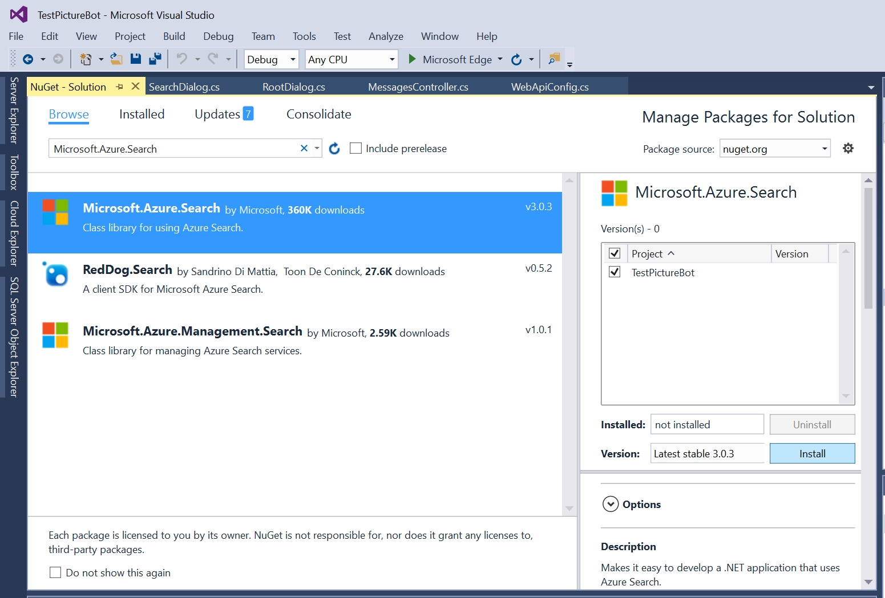

## 2_Azure_Search:
Estimated Time: 10-15 minutes

We now have a bot that can communicate with us if we use very specific words. The next thing we need to do is set up a connection to the Azure Search index we created in "lab02.1-azure_search." 

### Lab 2.1: Update the bot to use Azure Search

First, we need to update "SearchDialog.cs" so to request a search and process the response. We'll have to call Azure Search here, so make sure you've added the NuGet package (you should have done this in an earlier lab, but here's a friendly reminder).

 

Open "SearchDialog.cs" and review the code below. After you have an understanding of what we're doing, add it after the commented line "add search dialog contents here":
```csharp
            // Define the conversation flow using a waterfall model.
            this.Dialogs.Add(Id, new WaterfallStep[]
            {
                async (dc, args, next) =>
                {
                    // Prompt the user for what they want to search for.
                    // Instead of using SearchResponses.ReplyWithSearchRequest,
                    // we're experimenting with using text prompts
                    await dc.Prompt("textPrompt", "What would you like to search for?");
                },
                async (dc, args, next) =>
                {
                    // Save search request as 'facet'
                    var facet = args["Value"] as string;

                    await SearchResponses.ReplyWithSearchConfirmation(dc.Context, facet);

                    // Process the search request and send the results to the user
                    await StartAsync(dc.Context, facet);

                    // End the dialog
                    await dc.End();

                }
            });
            // Define the prompts used in this conversation flow.
            this.Dialogs.Add("textPrompt", new TextPrompt());
```
When we start the search dialog, the first thing we need to do is ask the user what they want to search for. You can read more about [prompting users here](https://docs.microsoft.com/en-us/azure/bot-service/bot-builder-prompts?view=azure-bot-service-4.0&tabs=csharp).  

In the next turn of the conversation, you can see that we're taking in the response from the user, confirming with the user what we're searching for, and waiting for the results of the StartAsync method before ending the dialog.

In order to process the search, there are several tasks we need to accomplish:
1.  Establish a connection to the search service
2.  Call the search service and store the results
3.  Put the results in a message and respond to the user

Discuss with a neighbor which methods below accomplish which tasks above, and how:
```csharp
        public async Task StartAsync(ITurnContext context, string searchText)
        {
            ISearchIndexClient indexClientForQueries = CreateSearchIndexClient();
            // For more examples of calling search with SearchParameters, see
            // https://github.com/Azure-Samples/search-dotnet-getting-started/blob/master/DotNetHowTo/DotNetHowTo/Program.cs.  
            // Call the search service and store the results
            DocumentSearchResult results = await indexClientForQueries.Documents.SearchAsync(searchText);
            await SendResultsAsync(context, searchText, results);
        }

        public async Task SendResultsAsync(ITurnContext context, string searchText, DocumentSearchResult results)
        {
            IMessageActivity activity = context.Activity.CreateReply();
            // if the search returns no results
            if (results.Results.Count == 0)
            {
                await SearchResponses.ReplyWithNoResults(context, searchText);
            }
            else // this means there was at least one hit for the search
            {
                // create the response with the result(s) and send to the user
                SearchHitStyler searchHitStyler = new SearchHitStyler();
                searchHitStyler.Apply(
                    ref activity,
                    "Here are the results that I found:",
                    results.Results.Select(r => ImageMapper.ToSearchHit(r)).ToList().AsReadOnly());

                await context.SendActivity(activity);
            }
        }

        public ISearchIndexClient CreateSearchIndexClient()
        {
            // Configure the search service and establish a connection, call it in StartAsync()
            // replace "YourSearchServiceName" and "YourSearchServiceKey" with your search service values
            string searchServiceName = "YourSearchServiceName";
            string queryApiKey = "YourSearchServiceKey";
            string indexName = "images";
            // if you named your index "images" as instructed, you do not need to change this value

            SearchIndexClient indexClient = new SearchIndexClient(searchServiceName, indexName, new SearchCredentials(queryApiKey));
            return indexClient;
        }
```

Now that you understand which piece does what and why, add the code below the comment "process search below" within SearchDialog.cs.  

Set the value for the "YourSearchServiceName" to be the name of the Azure Search Service that you created earlier.  If needed, go back and look this up in the [Azure portal](https://portal.azure.com).  

Set the value for the "YourSearchServiceKey" to be the key for this service.  This can be found in the [Azure portal](https://portal.azure.com) under the Keys section for your Azure Search.  In the below screenshot, the SearchServiceName would be "aiimmersionsearch" and the SearchServiceKey would be "375...".  

 

Finally, the SearchIndexName should be "images," but you may want to confirm that this is what you named your index.  

Press F5 to run your bot again.  In the Bot Emulator, try searching for something like "dogs" or "water".  Ensure that you are seeing results when tags from your pictures are requested.  

You might notice that if you run the bot, and immediately try to search for pictures, you are greeted instead. Why is that? Hint: review the `OnTurn` task in PictureBot.cs.

Get stuck? You can find the solution for this lab under [resources/code/FinishedPictureBot-Part2](./resources/code/FinishedPictureBot-Part2).  

### Continue to [3_LUIS](./3_LUIS.md)  
Back to [README](./0_README.md)
